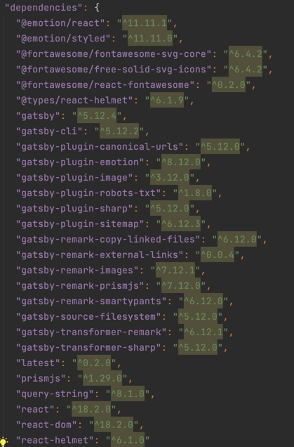

### Package Manager(패키지 매니저)

개인적으로 패키지 매니저는 리액트로 프로젝트를 할 때, 가장 처음 마주치는 용어라고 생각한다.   
무심코 `npm run start` 혹은 `yarn start` 명령어로 프로젝트를 실행시킨다.
문득 이게 어떻게 작동하는지 궁금하여 정리해본다.

---

#### Package Manager 란?
> 패키지를 설치, 업데이트, 수정, 삭제하는 작업을 편리하고 안전하게 수행하기 위해 사용하는 툴

보통, 운영체제마다 사용하는 패키지 매니저가 존재한다. 아래와 같은 명령어를 통해 해당 운영체제에서 프로그램을 쉽게 설치/삭제 등을 할 수 있다.
- macOS: homebrew
- window: winget
- Ubuntu(리눅스 계열): apt

GUI 환경에서는 윈도우의 앱 설치/삭제 기능에서 프로그램을 설치/삭제하는 용도와 동일한 기능을 하는 명령어이다.   
프론트엔드가 주로 사용하는 자바스크립트도 아래와 같은 패키지 매니저가 존재한다.
- npm
- yarn
- pnpm

#### Package Manager이 수행하는 일?
1. 패키지의 dependency(: 기존 패키지를 제대로 동작시키기 위해 필요한 다른 패키지를 의미함) 관리
2. 패키지의 보안 관리 - 신뢰할 수 있음(authenticity), 손상되지 않음(integrity) 보장
3. 여러 패키지를 기능에 따라 그룹으로 묶어 정리
4. 패키지 압축 해제
5. Software repository로부터 패키지를 찾고, 다운로드하고, 설치하고, 업데이트하는 역할

패키지 매니저는 dependency를 관리하는 한다는 것은 무슨 의미일까?   
자바스크립트 패키지 매니저는 package.json에 정의된 dependency들을 관리한다.

실제로, 현재 내가 작성하는 블로그에서 사용중인 dependency이다.   
따라서, `npm install` 혹은 `yarn add`를 하면 `package.json`에 기록된 dependency를 node_module 폴더에 생성하게된다.

#### NPM

2010년 1월에 세상에 나온 최초의 패키지 매니저이다.   
과거에는 프로젝트의 dependencies를 수동으로 관리했기 때문에, 엄청난 혁명이었다.
그러나 처음나온 만큼 사건사고도 끊이지 않았다.
npm v5.7.0에서 파일시스템 권한을 바꿀 수 있는 버그가 발견된 적이 있었고,   
`sudo npm` 명령어를 사용하면, 시스템 파일의 소유권을 변경하게 되어 os를 사용할 수 없게된 적이 있었다.
또한 2018년도에 EventStream 패키지 v3.3.6에서 악의적인 의존성이 추가되어, 개발자의 컴퓨터에서 비트코인을 훔치고자 하는 악의적인 코드가 존재한 적 있었다.   
이러한 문제를 해결하기 위해 요즘 최신버전의 npm에서는 `package-lock.json`에서 `SHA-512 알고리즘`을 확인하여 설치하고자 하는 패키지의 무결성을 확인한다.

#### Yarn

`Yet Another Resource Negotiator`의 약자로, yarn은 초기버전의 npm의 주요 문제점 중 하나였던 설치 프로세스의 속도를 높이기 위해 작업을 병렬화 하였다.
그리고 native 모노레포 지원, 오프라인 캐싱, cache-aware 설치의 개념을 도입하였다.
지금은 1.x 버전은 모두 레거시로 간주하고 yarn classic으로 이름이 바뀌었고 유지보수 모드로 전환되었다.
현재에는 yarn berry로 개발과 개선을 하고있다.

#### PNPM

2017년에 만들어졌으며, npm만 있다면 바로 사용할 수 있다.(drop-in replacement)
npm과 yarn의 메모리측 단점(node_modules 내부에 flat하게 패키지를 설치)을 해결하기 위해 출시되었다.
npm을 사용할 때 종속성을 사용하는 프로젝트가 100개 있는 경우 해당 종속성의 사본 100개가 디스크에 저장되지만, pnpm을 사용하면 의존성이 content-addressable 저장소에 저장한다.
예를들어, 다른 버전의 의존성에 여러분이 의존하는 경우, `pnpm update` 명령어로 다른 파일만이 저장소에 추가한다.
그리고 pnpm은 모든 파일을 디스크 상에서 단일 위치에 저장된다.
따라서, 패키지가 설치될 때 그 파일들은 단일 위치에서 하드링크되며 추가적인 디스크 공간을 소비하지 않는다.
이를 통해 프로젝트 간에 동일한 버전의 의존성을 공유할 수 있다..

#### 참고문헌
https://yceffort.kr/2022/05/npm-vs-yarn-vs-pnpm#npm-1