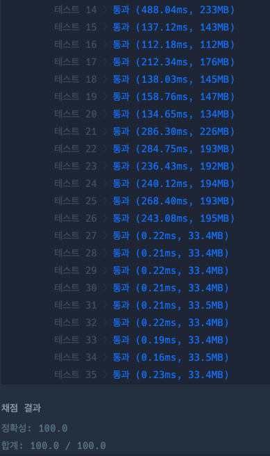

### SSR(Server-Side Rendering)

> 서버에서 UI를 렌더링하는 방식이며, `Next.js`, `PHP`, `ASP` 등이 있다.

<h4 style="margin: 10px 0px 10px 0px">동작방식</h4>

1️⃣ 클라이언트가 특정 페이지를 서버에 요청함  
2️⃣ 서버에서 해당 페이지에 필요한 데이터를 포함하여 HTML 파일을 클라이언트에 전달함  
&nbsp;&nbsp;&nbsp;&nbsp;&nbsp;(이때, HTML파일은 렌더링 준비를 마친 상태) 
3️⃣ 클라이언트는 받은 HTML 파일을 렌더하면서, 필요한 정적 리소스(이미지, CSS)와 자바스크립트 파일을 다운로드하며, 페이지를 렌더링 함(이 때, 사용자는 렌더링된 페이지를 볼 수 있으나 상호작용 불가능)  
4️⃣ 클라이언트에서 자바스크립트를 실행하여 페이지 상호작용을 가능하게 함

#### 특징

1. 최초 페이지 로딩 시간이 짧다

      요청한 페이지에 필요한 리소스만 다운로드하여 페이지를 생성하므로 렌더링에 필요한 시간은 짧다. 
      CSR만 한다면, 자바스크립트를 실행해야만 화면이 보이기 때문에 저사양 기기를 사용하는 사용자일수록 요청한 페이지가 느리게 보인다  
      따라서, 네트워크 인프라가 약하거나 저사양 기기를 사용하는 사용자가 많을 수록, SSR의 필요성은 높아진다.
       
       
   다만, 빈 HTML 문서를 전달하는 CSR 방식과 달리 SSR에서는 페이지를 생성하는 시간이 필요하므로   TTFB(Time to First Byte)는 CSR 방식보다 오래 걸린다.

> TTFB는 클라이언트가 서버에서 보낸 첫 번재 바이트가 수신하는 데까지 걸리는 시간

 
2. 자바스크립트 실행이 완료될 때까지 상호작용 불가 

   SSR은 사용자가 빠르게 페이지를 조회할 수는 있지만, 자바스크립트 실행이 완료될 때까지는 페이지 내에서 상호작용(클릭, 키보드 입력 등)이 불가능하다.

3. 페이지 이동에 걸리는 시간이 CSR보다 오래걸린다. 

   페이지를 이동할 때마다, 필요한 리소스를 다운로드하고 페이지를 다시 생성해야 하므로 페이지 이동에 시간이 오래걸린다.

 4. 검색 엔진 최적화(Search Engine Optimization, SEO)에 필수적이다.

   서버에서 클라이언트 초기 응답에 요청 받은 페이지에 필요한 자원을 모두 HTML로 만들고 응답하기 때문에, 서버에 부하가 있다는 특징이 있다. 이러한 특징으로 인해 자바스크립트를 읽을 줄 모르는 SEO에 유리하다.  
   구글을 제외한 다른 검색 엔진에서는 자바스크립트를 실행하지 않기 때문에 CSR만 렌더링하는 사이트는 내용이 없는 사이트와 동일하게 처리된다.   게다가, 구글도 서버사이드 렌더링을 하는 사이트에 더 높은 점수를 부여한다고 알려져있다.

