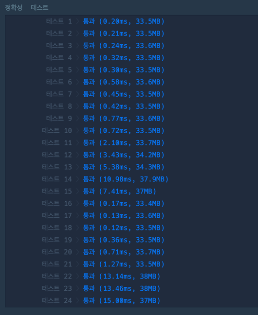

## 문제
`구현` `스택`

과제를 받은 루는 다음과 같은 순서대로 과제를 하려고 계획을 세웠습니다.   

과제는 시작하기로 한 시각이 되면 시작합니다.   
새로운 과제를 시작할 시각이 되었을 때, 기존에 진행 중이던 과제가 있다면 진행 중이던 과제를 멈추고 새로운 과제를 시작합니다.   
진행중이던 과제를 끝냈을 때, 잠시 멈춘 과제가 있다면, 멈춰둔 과제를 이어서 진행합니다.
만약, 과제를 끝낸 시각에 새로 시작해야 되는 과제와 잠시 멈춰둔 과제가 모두 있다면, 새로 시작해야 하는 과제부터 진행합니다.   
멈춰둔 과제가 여러 개일 경우, 가장 최근에 멈춘 과제부터 시작합니다.   
과제 계획을 담은 이차원 문자열 배열 `plans`가 매개변수로 주어질 때, **과제를 끝낸 순서대로 이름을 배열**에 담아 return 하는 solution 함수를 완성해주세요.   

## 접근 방법

1. 제한사항  3 ≤ `plans의 길이` ≤ 1,000 이므로, 완전탐색으로 선택했다.
2. 문제 중에 "가장 최근에 멈춘 과제부터 시작한다" 조건이 있으므로, 멈춰둔 과제는 스택으로 관리했다.
3. 시작시간을 모두 "분"으로 변환하여 시간 계산을 하기에 편리하도록 했다.
4. 과제 시작시간 기준 오름차순으로 정렬하고, 아래와 같은 조건으로 구현했다.
5. termTime(현재 과제 시작시간 - 다음 과제 시작시간)이 needTime(현재 과제 필요시간) 작다면, 스택에 넣는다.<br/>**(이때, 잔여시간을 갱신해준다)**   
   5-1. 크거나 같으면, 과제를 완료했으며로 answer에 넣는다.   
   5-2. 잔여시간(다음 과제시작시간을 수행하기에 앞서 남은 시간)이 있으면 스택에서 중단한 과제를 꺼낸다.   
   5-3. 중단한 과제 필요시간만큼 잔여시간을 계산해주고, 수행을 완료했다면 스택에서 빼고 answer에 넣어준다.

만약, 4~10번이 계속 틀린 경우, 잔여시간을 갱신하지 않아서 생긴 문제일 가능성이 크다.   
수행한 과제가 한번에 끝내지 못할 경우, 해당 과제를 수행하는데 남은 시간을 잘 갱신했는지 체크해보자.
## 코드풀이

```javascript
// 분으로 계산하는 함수
const cvrtTimeToMinute = (time) => {
    const times = time.split(":");
    return times[0] * 60 + (+times[1]);
}
// 잔여시간 계산하는 함수
const getTermTime = (startTime, endTime) => {
    return endTime - startTime;
}

function solution(plans) {
    let answer = []; // 끝난 과제
    let stack = []; // 중단한 과제
    plans.sort((a,b) => cvrtTimeToMinute(a[1]) - cvrtTimeToMinute(b[1])); // 시작시간 오름차순 정렬

    for(let i=0; i<plans.length -1; i++){
        let termTime = getTermTime(cvrtTimeToMinute(plans[i][1]), cvrtTimeToMinute(plans[i+1][1]));
        let needTime = +plans[i][2];

        if(termTime < needTime){
            plans[i][2] -= termTime;
            stack.push(plans[i]);
        }else{
            answer.push(plans[i][0])
            termTime -= needTime;

            while(stack.length > 0  && termTime > 0 ){
                const temp = stack[stack.length - 1];
                termTime -= temp[2];

                if(termTime >= 0){
                    answer.push(stack.pop()[0])
                }else{
                    stack[stack.length - 1][2] =  Math.abs(termTime);
                }
            }
        }

    }
    answer.push(plans[plans.length - 1][0])

    while(stack.length > 0){
        answer.push(stack.pop()[0])
    }

    return answer;
}
```

