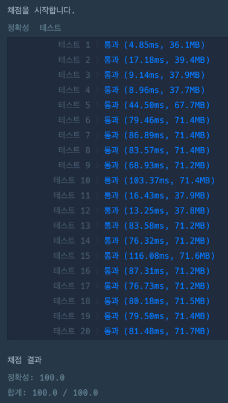

## 문제

철수는 롤케이크를 두 조각으로 잘라서 동생과 한 조각씩 나눠 먹으려고 합니다. 이 롤케이크에는 여러가지 토핑들이 일렬로 올려져 있습니다. 
철수와 동생은 롤케이크를 공평하게 나눠먹으려 하는데, 그들은 롤케이크의 크기보다 롤케이크 위에 올려진 토핑들의 종류에 더 관심이 많습니다. 
그래서 잘린 조각들의 크기와 올려진 토핑의 개수에 상관없이 각 조각에 동일한 가짓수의 토핑이 올라가면 공평하게 롤케이크가 나누어진 것으로 생각합니다.

예를 들어, 롤케이크에 4가지 종류의 토핑이 올려져 있다고 합시다. 
토핑들을 1, 2, 3, 4와 같이 번호로 표시했을 때, 케이크 위에 토핑들이 [1, 2, 1, 3, 1, 4, 1, 2] 순서로 올려져 있습니다.    
만약 세 번째 토핑(1)과 네 번째 토핑(3) 사이를 자르면 롤케이크의 토핑은 [1, 2, 1], [3, 1, 4, 1, 2]로 나뉘게 됩니다.    
철수가 [1, 2, 1]이 놓인 조각을, 동생이 [3, 1, 4, 1, 2]가 놓인 조각을 먹게 되면 철수는 두 가지 토핑(1, 2)을 맛볼 수 있지만, 동생은 네 가지 토핑(1, 2, 3, 4)을 맛볼 수 있으므로, 이는 공평하게 나누어진 것이 아닙니다.    
만약 롤케이크의 네 번째 토핑(3)과 다섯 번째 토핑(1) 사이를 자르면 [1, 2, 1, 3], [1, 4, 1, 2]로 나뉘게 됩니다. 이 경우 철수는 세 가지 토핑(1, 2, 3)을, 동생도 세 가지 토핑(1, 2, 4)을 맛볼 수 있으므로, 이는 공평하게 나누어진 것입니다.   
공평하게 롤케이크를 자르는 방법은 여러가지 일 수 있습니다. 위의 롤케이크를 [1, 2, 1, 3, 1], [4, 1, 2]으로 잘라도 공평하게 나뉩니다. 어떤 경우에는 롤케이크를 공평하게 나누지 못할 수도 있습니다.   
   
롤케이크에 올려진 토핑들의 번호를 저장한 정수 배열 topping이 매개변수로 주어질 때, **롤케이크를 공평하게 자르는 방법의 수**를 return 하도록 solution 함수를 완성해주세요.

## 접근 방법

제한사항 `1 <= topping의 길이 <= 1,000,000`이므로, O(N)으로 풀어야하는 문제이다.

for문을 돌면서 철수와 동생의 토핑을 slice()로 나누어서 한다면, O(N^2)이 되므로, 시간초과가 발생한다.
slice()는 배열을 전체탐색하면서 인덱스를 찾아 자르기 때문에, O(N)이다.

그래서, 내가 찾은 방법은 `Map`과 `Set`을 이용하는 것이다.   
Map은 토핑별 갯수를 저장하고, Set은 철수와 동생이 가지는 토핑을 저장한다.   
for문 탐색을 하기 전에 동생이 모든 토핑을 가지고 있다고 가정한다.   
이후, for문을 돌면서 철수가 토핑을 가지며 Map에 저장된 토핑의 가짓수를 하나씩 제거한다.
그리고 토핑이 0개가 되면 토핑 자체를 제거하고 동생 Set에서도 해당 토핑을 제거한다.
철수와 동생의 토핑을 size로 접근하여 비교하여 같으면 answer를 증가시켰다.

## 코드풀이

```javascript
function solution(topping) { 
    let answer = 0;
    let toppingMap = {} // 토핑별 갯수
    let mine = new Set([]);  // 철수
    
    topping.map((item) => {
        if(toppingMap.hasOwnProperty(item)) toppingMap[item] +=1;
        else toppingMap[item] = 1;
    })
    
    let brother = new Set(Object.keys(toppingMap)); // 동생
    
    for(let i=0; i<topping.length; i++){
        mine.add(topping[i]);
        toppingMap[topping[i]] -=1;
        if(toppingMap[topping[i]] == 0){
            brother.delete(topping[i].toString())
        }  
        
        if(mine.size == brother.size) answer+=1;
    }
    
    return answer;
}
```

