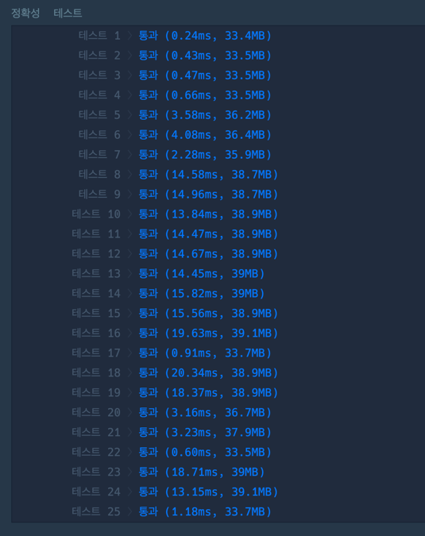

## 문제

메리는 여름을 맞아 무인도로 여행을 가기 위해 지도를 보고 있습니다.   
지도에는 바다와 무인도들에 대한 정보가 표시돼 있습니다.    
지도는 1 x 1크기의 사각형들로 이루어진 직사각형 격자 형태이며, 격자의 각 칸에는 'X' 또는 1에서 9 사이의 자연수가 적혀있습니다.   
지도의 'X'는 바다를 나타내며, 숫자는 무인도를 나타냅니다.   
이때, **상, 하, 좌, 우**로 연결되는 땅들은 하나의 무인도를 이룹니다. 

지도의 각 칸에 적힌 숫자는 식량을 나타내는데, 상, 하, 좌, 우로 연결되는 칸에 적힌 숫자를 모두 합한 값은 해당 무인도에서 최대 며칠동안 머물 수 있는지를 나타냅니다.     
어떤 섬으로 놀러 갈지 못 정한 메리는 우선 각 섬에서 최대 며칠씩 머물 수 있는지 알아본 후 놀러갈 섬을 결정하려 합니다.

지도를 나타내는 문자열 배열 `maps`가 매개변수로 주어질 때, 각 섬에서 **최대 며칠씩 머무를 수 있는지 배열에 오름차순**으로 담아 return 하는 solution 함수를 완성해주세요.    
만약 지낼 수 있는 무인도가 없다면 **-1을 배열에 담아 return** 해주세요.

## 접근 방법

제한사항 `3 ≤ maps의 길이 ≤ 100`이므로, DFS로 풀수 있지만, BFS 연습삼아 큐를 이용해서 풀었다.   
구현 방식은 아래와 같다.

1. 각 노드의 방문 여부를 체크하는 배열 필요(visit)
2. X가 아니는 노드에서 상하좌우를 이동할 방향 배열 선언(direction)
3. X가 아닌 노드는 모두 방문해야하므로 maps를 전체탐색하여 인접한 노드 방문 및 식량 계산

큐(Queue)는 제한사항이 100이기 때문에 배열로 풀어도 상관은 없지만, 포인터 연습할 겸 직접 구현하여 풀었다.

## 코드풀이

```javascript
class Queue {
    constructor() {
        this.queue = [];
        this.front = 0;
        this.rear = 0;
    }

    isEmpty = () => {
        return this.front == this.rear;
    }

    enqueue = (value) => {
        this.queue.push(value);
        this.rear++;
    }

    peek = () => {
        return this.queue[this.front];
    }

    dequeue = () => {
        const value = this.queue[this.front];
        this.front++;
        if(isEmpty()){
            this.queue = [];
            this.front = 0;
            this.rear = 0;
        }
        return value;
    }
}

function solution(maps) {
    const direction = [[1, 0], [-1, 0], [0, -1], [0, 1]]
    let visit = Array.from({length: maps.length}, () => Array.from({length: maps[0].length}, () => false))
    let answer = [];
    const myQueue = new Queue();

    for(let m=0; m<maps.length; m++){
        for(let k=0; k<maps[0].length; k++){
            const res = bfs(maps, m, k, visit, myQueue, direction)
            if(res) answer.push(res)
        }
    }
    if(answer.length == 0) return [-1];
    return answer.sort((a,b) => a-b);
}

const bfs = (maps, m, k, visit, myQueue, direction) => {
    if(maps[m][k] !== "X" && !visit[m][k]){
        let count = +maps[m][k];
        myQueue.enqueue([m, k]);
        visit[m][k] = true;

        while(!myQueue.isEmpty()) {
            const [sy, sx] = myQueue.dequeue();
            
            if(maps[sy][sx] !== "X"){
                for(let i =0; i<4; i++){
                    let [ny, nx] = [sy+direction[i][0], sx+direction[i][1]];

                    if( 0<=nx && nx<maps[0].length && 0<=ny && ny<maps.length) {
                        if(!visit[ny][nx] && maps[ny][nx] !== "X") {
                            myQueue.enqueue([ny, nx]);
                            count += +maps[ny][nx]
                            visit[ny][nx] = true;
                        }
                    }

                }
            }
        }
        return count
    }
}
```

