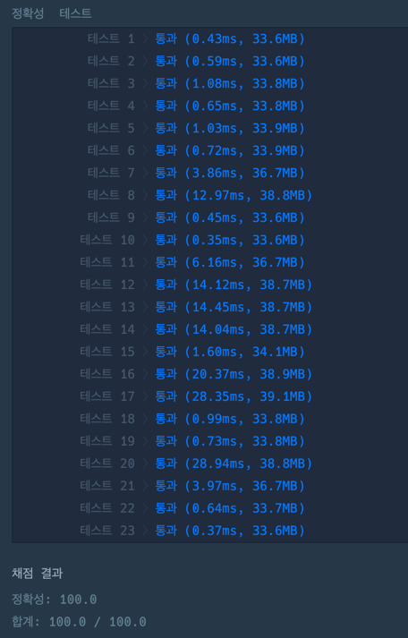

## 문제
`BFS` `큐`

1 x 1 크기의 칸들로 이루어진 직사각형 격자 형태의 미로에서 탈출하려고 합니다.   
각 칸은 통로 또는 벽으로 구성되어 있으며, **벽으로 된 칸은 지나갈 수 없고** 통로로 된 칸으로만 이동할 수 있습니다.    
통로들 중 한 칸에는 미로를 빠져나가는 문이 있는데, 이 문은 레버를 당겨서만 열 수 있습니다. 레버 또한 통로들 중 한 칸에 있습니다.    
따라서, 출발 지점에서 먼저 레버가 있는 칸으로 이동하여 레버를 당긴 후 미로를 빠져나가는 문이 있는 칸으로 이동하면 됩니다.     
이때 아직 레버를 당기지 않았더라도 출구가 있는 칸을 지나갈 수 있습니다.    
미로에서 한 칸을 이동하는데 1초가 걸린다고 할 때, 최대한 빠르게 미로를 빠져나가는데 걸리는 시간을 구하려 합니다.

미로를 나타낸 문자열 배열 maps가 매개변수로 주어질 때,     
미로를 **탈출하는데 필요한 최소 시간**을 return 하는 solution 함수를 완성해주세요.     
만약, **탈출할 수 없다면 -1**을 return 해주세요.

## 접근 방법

1. 제한사항  `5 ≤ maps의 길이 ≤ 100` 과 `5 ≤ maps[i]의 길이 ≤ 100` 이므로, 배열로 큐를 관리했다.
2. 문제를 자세히 읽어보면, 레버를 지나야지만 탈출이 가능하므로, **시작 -> 레버** 구간과 **레버 -> 출구** 구간의 최소시간을 구해야한다.
3. 방문처리르 할 때, 최소시간이어야 하므로 해당 노드의 값이 최솟값을 유지하도록 조건을 추가해준다.
4. 해당 구간의 종착지의 값의 합으로 계산해주면 된다.

## 코드풀이

```javascript
const direction = [[1, 0], [-1, 0], [0, -1], [0, 1]] // 동서남북
const getPos = (maps, char) => {
    for(let y=0; y<maps.length; y++){
        for(let x=0; x<maps[y].length; x++){
            if(maps[y][x] == char) return [y, x];
        }
    }
}

const bfs = (visited, startPos, maps) => {
    let q = [];
    q.push(startPos);
    visited[startPos[0]][startPos[1]] = 0;

    while(q.length > 0) {
        const start = q.shift();

        for (let pos = 0; pos < 4; pos++) {
            let [cx, cy] = [
                start[0] + direction[pos][0],
                start[1] + direction[pos][1]];

            if (0 <= cx && cx < maps.length && 0 <= cy && cy < maps[0].length) {
                if (maps[cx][cy] != "X" && visited[cx][cy] > visited[start[0]][start[1]] + 1) {
                    visited[cx][cy] = visited[start[0]][start[1]] + 1;
                    q.push([cx, cy]);
                }
            }
        }
    }

    return visited;
}

function solution(maps) {
    let answer = 0;
    let sLroute = [...maps].map((item) => item.split('').map((info) => info = Infinity)); // S -> L
    let lEroute = [...maps].map((item) => item.split('').map((info) => info = Infinity)); // L -> S
    const startPos = getPos(maps, "S");
    const laberPos = getPos(maps, "L");
    const endPos = getPos(maps, "E");

    const StoL = bfs(sLroute, startPos, maps);
    const LtoE = bfs(lEroute, laberPos, maps);
    
    answer = StoL[laberPos[0]][laberPos[1]] + LtoE[endPos[0]][endPos[1]];
    
    return answer == Infinity ? -1 : answer;
    
}

```



#### 문제 링크

https://school.programmers.co.kr/learn/courses/30/lessons/159993