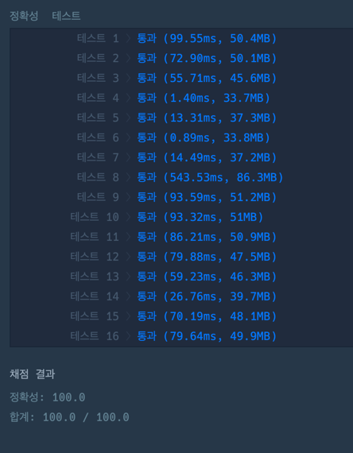

## 문제
`DP`

자연수 x를 y로 변환하려고 합니다. 사용할 수 있는 연산은 다음과 같습니다.

x에 n을 더합니다   
x에 2를 곱합니다.   
x에 3을 곱합니다.   

자연수 x, y, n이 매개변수로 주어질 때, **x를 y로 변환**하기 위해 필요한 **최소 연산 횟수**를 return하도록 solution 함수를 완성해주세요.   
이때 **x를 y로 만들 수 없다면 -1**을 return 해주세요

## 접근 방법

제한 사항은 `1 ≤ x ≤ y ≤ 1,000,000` 이므로, 재귀로 풀면 `스택 오버플로`가 발생한다.   
코테에서 **재귀**는 제한사항이 **1,000이하**에서만 사용할수 있다는 것을 명심하자.   
(DFS로 접근해서 풀다가 부딪혀서 알게되었다:D)

그래서 찾은 접근법은 **DP**이다.   
문제에서는 `x -> y`로 만드는 **최소 횟수**지만, 이걸 반대로 생각하면 `y -> x`로 만드는 **최소 횟수**라고 생각할 수 있다.

또한, 연산 조건들도 반대로 생각하면 아래와 같다.   
y에 n을 뺀다.   
y에 2를 나눈다.   
y에 3을 나눈다.   

이러한 사고로 문제를 접근했다.

1. dp를 y의 길이만큼 생성 및 초기화(구해야 할 값은 최솟값이기에, Infinity로 초기화함)
2. dp[x]는 시작점으로 무조건 0이다.
3. `x+1`부터 `y`까지 탐색하면서, **이전값**에 조건 사항을 반영한다.   
    첫번째 조건사항 이전값은 `y`입장에서 생각해보면  -> `y-n`이 성립된다.   
    주의해야할 점은 **dp[y-n]에 값이 있어야 한다.**   
   (예를 들어, n이 1인 경우, 20(y)이 19(y-n)이 될 수 없는 상황에서 +n 을 한다고 해도 나올 수 없기 때문이다.)   
    마찬가지로, **y % 2 == 0**이어야한다. (자연수 곱하기에는 소수점이 나올 수 없기 때문이다.)
4. 해당 값을 `Math.min(dp[y-n]+1, dp[y/2]+1, dp[y/3]+1)`으로 구한다.


## 코드풀이

```javascript
function solution(x, y, n) {
    let dp = Array.from({length: y + 1}, () => Infinity);
    dp[x] = 0;

    const isValidValue = (v) => {
        return v != Infinity && v != undefined
    }

    for (let i = x + 1; i <= y; i++) {
        if (isValidValue(dp[i - n])) {
            dp[i] = Math.min(dp[i], dp[i - n] + 1);
        }

        if (i % 2 == 0 && isValidValue(dp[i / 2])) {
            dp[i] = Math.min(dp[i], dp[i / 2] + 1);
        }

        if (i % 3 == 0 && isValidValue(dp[i / 3])) {
            dp[i] = Math.min(dp[i], dp[i / 3] + 1);
        }
    }
    return isValidValue(dp[y]) ? dp[y] : -1;
}
```



#### 문제 링크

https://school.programmers.co.kr/learn/courses/30/lessons/154538