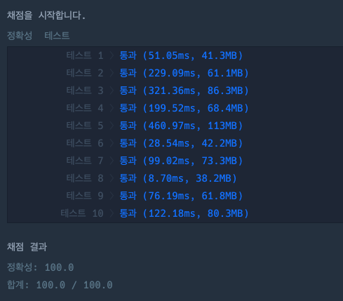

## 문제

`스택` `완전탐색`

영재는 택배상자를 트럭에 싣는 일을 합니다.  
영재가 실어야 하는 택배상자는 크기가 모두 같으며 1번 상자부터 n번 상자까지 번호가 증가하는 순서대로 컨테이너 벨트에 일렬로 놓여 영재에게 전달됩니다.  
**컨테이너 벨트는 한 방향으로만 진행이 가능해서 벨트에 놓인 순서대로(1번 상자부터) 상자를 내릴 수 있습니다.**  
하지만 컨테이너 벨트에 놓인 순서대로 택배상자를 내려 바로 트럭에 싣게 되면 택배 기사님이 배달하는 순서와 택배상자가 실려 있는 순서가 맞지 않아 배달에 차질이 생깁니다. 따라서 택배 기사님이 미리 알려준 순서에 맞게 영재가 택배상자를 실어야 합니다.

만약 컨테이너 벨트의 맨 앞에 놓인 상자가 현재 트럭에 실어야 하는 순서가 아니라면 그 상자를 트럭에 실을 순서가 될 때까지 잠시 다른 곳에 보관해야 합니다.  
하지만 고객의 물건을 함부로 땅에 둘 수 없어 보조 컨테이너 벨트를 추가로 설치하였습니다.  
**보조 컨테이너 벨트는 앞 뒤로 이동이 가능하지만 입구 외에 다른 면이 막혀 있어서 맨 앞의 상자만 뺄 수 있습니다(즉, 가장 마지막에 보조 컨테이너 벨트에 보관한 상자부터 꺼내게 됩니다).**  
보조 컨테이너 벨트를 이용해도 기사님이 원하는 순서대로 상자를 싣지 못 한다면, 더 이상 상자를 싣지 않습니다.

예를 들어, 영재가 5개의 상자를 실어야 하며, 택배 기사님이 알려준 순서가 기존의 컨테이너 벨트에 네 번째, 세 번째, 첫 번째, 두 번째, 다섯 번째 놓인 택배상자 순서인 경우, 영재는 우선 첫 번째, 두 번째, 세 번째 상자를 보조 컨테이너 벨트에 보관합니다. 그 후 네 번째 상자를 트럭에 싣고 보조 컨테이너 벨트에서 세 번째 상자 빼서 트럭에싣습니다. 다음으로 첫 번째 상자를 실어야 하지만 보조 컨테이너 벨트에서는 두 번째 상자를, 기존의 컨테이너 벨트에는 다섯 번째 상자를 꺼낼 수 있기 때문에 더이상의 상자는 실을 수 없습니다. 따라서 트럭에는 2개의 상자만 실리게 됩니다.

택배 기사님이 원하는 상자 순서를 나타내는 정수 배열 `order`가 주어졌을 때,  
**영재가 몇 개의 상자를 실을 수 있는지** return 하는 solution 함수를 완성하세요.

## 접근 방법

제한사항 `1 ≤ order의 길이 ≤ 1,000,000`이므로, O(N)으로 해결해야한다.
또한, 보조 컨테이너 벨트는 스택(Stack) 구조이다.

컨테이너벨트와 보조 컨테이너벨트를 탐색하면서 택배기사가 원하는 상자와 동일하면 상자를 실고,  
동일하지 않다면, 보조 컨테이너 벨트에 잠시 넣어둔다.
이때, 주의해야할 점은 컨테이너벨트 탐색이 끝나면 보조 컨테이너벨트도 탐색해줘야한다.(이 부분을 예상하지 못해서 여러번 틀렸다.)

스택은 배열로 관리하면 편하지만, 속도 제한을 신경안쓰기 위해서 포인터로 구현했다.

## 코드풀이

```javascript
class LIFO {
  constructor() {
    this.tempArray = []
    this.front = 0
    this.rear = 0
  }

  pushItem(item) {
    this.rear += 1
    this.tempArray[this.rear] = item
  }

  peekItem() {
    return this.tempArray[this.rear]
  }

  popItem() {
    this.rear -= 1
    if (this.rear == -1) {
      this.tempArray = []
      this.rear = 0
      this.front = 0
    }
  }
}

function solution(order) {
  let answer = 0
  let tempBelt = new LIFO()
  let belt = [...order].sort((a, b) => a - b) // 컨베이어벨트는 순차적으로 상자가 놓여져있다.
  let orderIndex = 0
  let beltIndex = 0

  while (true) {
    if (orderIndex >= order.length) return answer
    if (beltIndex > belt.length) {
      // 컨베이어벨트 탐색이 끝나면, 보조벨트하고만 비교해야함
      if (order[orderIndex] == tempBelt.peekItem()) {
        tempBelt.popItem()
        answer++
        orderIndex++
      } else return answer
    }

    if (belt[beltIndex] == order[orderIndex]) {
      answer++
      orderIndex++
      beltIndex++
    } else if (order[orderIndex] == tempBelt.peekItem()) {
      tempBelt.popItem()
      answer++
      orderIndex++
    } else {
      tempBelt.pushItem(belt[beltIndex])
      beltIndex++
    }
  }

  return answer
}
```


