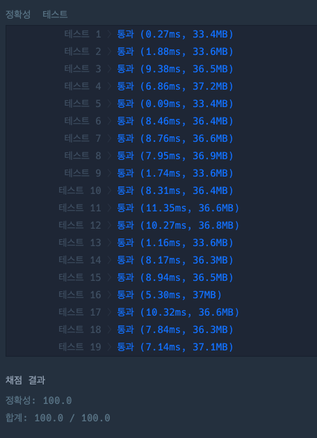

## 문제

`완전탐색` `시뮬레이션`

호텔을 운영 중인 코니는 최소한의 객실만을 사용하여 예약 손님들을 받으려고 합니다.  
한 번 사용한 객실은 퇴실 시간을 기준으로 10분간 청소를 하고 다음 손님들이 사용할 수 있습니다.  
예약 시각이 문자열 형태로 담긴 2차원 배열 `book_time`이 매개변수로 주어질 때,  
코니에게 필요한 **최소 객실의 수**를 return 하는 solution 함수를 완성해주세요.

## 접근 방법

제한사항 `1 <= book_time의 길이 <= 1,000`이므로, 이중 for문으로 접근했다.

먼저, 호텔 대실 시작시간 기준 오름차순으로 정렬했다.  
이후 모든 시간을 분으로 통일화(**_convertTime_**) 하고 대실 종료시간을 청소시간을 계산(**_getEndTime_**)하여 구했다.  
이후, 방의 종료시간을 저장하는 리스트(**_endTimeRoom_**)을 만들고  
예약시간과 endTimeRoom을 탐색하며 **예약 시작시간 >= 방의 종료시간**이면, 해당 방의 종료시간을 **갱신**했다.  
해당 예약시간에 들어갈수 있는 방이 없다면 해당 종료시간으로 방을 추가해줬다.  
따라서, endTimeRoom의 길이를 반환함으로써 정답을 구했다.

## 코드풀이

```javascript
const convertTime = time => {
  const hm = time.split(':')
  return hm[0] * 60 + +hm[1]
}

const getEndTime = time => {
  return convertTime(time) + 10
}

function solution(book_time) {
  const endTimeRoom = []
  book_time.sort((a, b) => convertTime(a[0]) - convertTime(b[0])) // 대실 시작시간 기준 오름차순 정렬

  for (let bookIndex = 0; bookIndex < book_time.length; bookIndex++) {
    const start = convertTime(book_time[bookIndex][0])
    const end = getEndTime(book_time[bookIndex][1])
    let isChange = false

    if (endTimeRoom.length == 0) {
      // 처음에는 무조건 방이 비어있음
      endTimeRoom.push(end)
      continue
    }

    for (let roomIndex = 0; roomIndex < endTimeRoom.length; roomIndex++) {
      if (start >= endTimeRoom[roomIndex]) {
        endTimeRoom[roomIndex] = end
        isChange = true
        break
      }
    }
    if (!isChange) endTimeRoom.push(end)
  }

  return endTimeRoom.length
}
```


